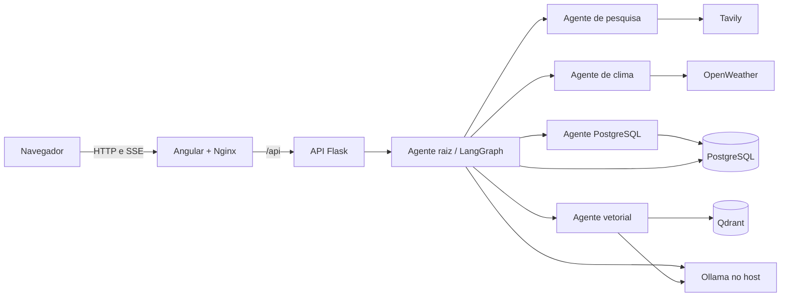

# Assistente multiagente

Aplicação de chat com interface Angular, API Flask com streaming SSE e uma
orquestração multiagente construída com LangGraph. O agente raiz delega tarefas
especializadas para pesquisa web, previsão do tempo, consultas PostgreSQL e
busca semântica no Qdrant. As conversas e interrupções ficam persistidas no
PostgreSQL.

## Arquitetura



| Componente | Tecnologia | Responsabilidade |
| --- | --- | --- |
| UI | Angular 22 e Nginx | Chat, Markdown, decisões de autorização e proxy da API |
| API | Flask e Python 3.12 | Endpoint SSE, validação e execução dos grafos |
| Orquestração | LangChain e LangGraph | Roteamento entre agentes, ferramentas e checkpoints |
| Modelos | Ollama ou endpoint compatível | Chat e geração de embeddings |
| Persistência | PostgreSQL 16 | Dados de negócio e checkpoints das conversas |
| Busca vetorial | Qdrant | Indexação e recuperação semântica do dataset |

## Funcionalidades

- Respostas incrementais via Server-Sent Events (SSE).
- Conversas persistentes identificadas por `thread_id`.
- Retomada de execuções interrompidas para autorizar alterações no banco.
- Consultas SQL limitadas às tabelas `customers`, `products` e `orders`.
- Pesquisa web com Tavily e clima com OpenWeather.
- Busca semântica em uma coleção Qdrant.
- Modelo padrão e modelos específicos configuráveis por agente.
- Execução completa com Docker Compose ou desenvolvimento local com `uv` e npm.

## Estrutura do projeto

```text
agents/                  Configuração dos agentes especializados
app/
  api.py                 API Flask e protocolo SSE
  ingest.py              Ingestão do CSV no Qdrant
  data/                   Dataset usado pela busca vetorial
  utils/                  LLM, embeddings, contexto e checkpointer
graph/                    Grafos, estados, nós e prompts do LangGraph
tools/                    Ferramentas de clima, pesquisa, SQL e busca vetorial
tests/                    Testes automatizados da API e dos agentes
ui/                       Aplicação Angular e configuração Nginx
docker-compose.yml        Orquestração de todos os serviços
Dockerfile                Imagem Python instalada com uv
```

## Pré-requisitos

Para executar tudo em containers:

- Docker Desktop com Docker Compose v2.
- Ollama em execução no computador host.
- Modelos de chat e embedding instalados no Ollama.
- Chaves do OpenWeather e Tavily para usar as respectivas ferramentas.

Para desenvolvimento local também são necessários Python 3.12, `uv`, Node.js
24 e npm 11.

## Configuração

Crie o arquivo local de configuração a partir do exemplo:

```shell
cp .env.example .env
```

No PowerShell:

```powershell
Copy-Item .env.example .env
```

O `.env` é ignorado pelo Git. Nunca adicione chaves reais ou senhas ao
`.env.example`.

### Modelos e contexto

| Variável | Descrição | Exemplo |
| --- | --- | --- |
| `LLM_MODEL_DEFAULT` | Modelo usado quando um agente não possui override | `ollama:qwen3:8b` |
| `LLM_BASE_URL` | URL do provedor de chat, usada localmente e no Docker | `http://192.168.0.2:11434` |
| `LLM_API_KEY` | Credencial do provedor; para Ollama local pode ser um valor não secreto | `ollama` |
| `LLM_TEMPERATURE` | Aleatoriedade das respostas | `0.7` |
| `LLM_CONTEXT_WINDOW` | Total de tokens disponíveis para entrada e resposta | `32768` |
| `LLM_RESPONSE_TOKEN_RESERVE` | Tokens reservados para a resposta | `4096` |
| `ROOT_AGENT_MODEL` | Modelo específico do orquestrador | mesmo formato do modelo padrão |
| `POSTGRES_AGENT_MODEL` | Modelo específico do agente SQL | mesmo formato do modelo padrão |
| `SEARCH_AGENT_MODEL` | Modelo específico do agente de pesquisa | mesmo formato do modelo padrão |
| `WEATHER_AGENT_MODEL` | Modelo específico do agente de clima | mesmo formato do modelo padrão |
| `VECTOR_DB_AGENT_MODEL` | Modelo específico do agente vetorial | mesmo formato do modelo padrão |

`LLM_CONTEXT_WINDOW` precisa ser maior que `LLM_RESPONSE_TOKEN_RESERVE`. O
histórico antigo é reduzido quando necessário, preservando a rodada atual e os
pares de chamada e resultado das ferramentas.

### Embeddings e Qdrant

| Variável | Descrição | Padrão sugerido |
| --- | --- | --- |
| `EMBEDDING_PROVIDER` | Provedor de embeddings: `ollama` ou `openai` | `ollama` |
| `EMBEDDING_MODEL_DEFAULT` | Modelo usado para vetorização | `qwen3-embedding:4b` |
| `EMBEDDING_BASE_URL` | URL do Ollama para embeddings, usada localmente e no Docker (ignorada com OpenAI) | `http://192.168.0.2:11434` |
| `OPENAI_API_KEY` | Chave exigida quando o provedor é `openai` | sem valor público |
| `DATA_SET_PATH` | CSV usado por `app.ingest` | `app/data/python_faq_dataset.csv` |
| `QDRANT_URL` | URL do Qdrant para execução local | `http://localhost:6333` |
| `COLLECTION_NAME` | Nome da coleção vetorial | `python_faq` |
| `QDRANT_HTTP_PORT` | Porta HTTP publicada pelo Compose | `6333` |
| `QDRANT_GRPC_PORT` | Porta gRPC publicada pelo Compose | `6334` |

### PostgreSQL e LangGraph

| Variável | Descrição | Padrão sugerido |
| --- | --- | --- |
| `POSTGRES_DB` | Nome do banco | `agent_db` |
| `POSTGRES_USER` | Usuário do banco | `postgres` |
| `POSTGRES_PASSWORD` | Senha local, que deve ser alterada | sem valor público |
| `POSTGRES_HOST` | Host usado fora do Docker | `localhost` |
| `POSTGRES_PORT` | Porta publicada pelo Compose | `5432` |
| `DATABASE_URL` | URL SQLAlchemy com driver Psycopg | `postgresql+psycopg://...` |
| `LANGGRAPH_CHECKPOINT_DB_URI` | URI Psycopg usada pelo checkpointer | `postgresql://...` |
| `LANGGRAPH_CHECKPOINT_POOL_MIN_SIZE` | Mínimo de conexões do pool | `1` |
| `LANGGRAPH_CHECKPOINT_POOL_MAX_SIZE` | Máximo de conexões do pool | `10` |
| `LANGGRAPH_THREAD_ID` | Thread usada pelo modo CLI | `default-conversation` |

O Compose substitui host e URLs do banco pelos endereços internos da rede
Docker. As tabelas de checkpoints são preparadas automaticamente pelo
LangGraph. O script `tools/postgres/init.sql` cria e popula as tabelas de
exemplo na primeira inicialização de um diretório de dados vazio.

### Serviços, Docker e APIs externas

| Variável | Descrição | Padrão sugerido |
| --- | --- | --- |
| `API_HOST` | Interface da API em execução local | `127.0.0.1` |
| `API_PORT` | Porta publicada da API | `5000` |
| `UI_PORT` | Porta publicada da interface | `4200` |
| `OPENWEATHER_API_KEY` | Chave da API OpenWeather | obrigatória para clima |
| `TAVILY_API_KEY` | Chave da API Tavily | obrigatória para pesquisa web |

## Ollama no computador host

Instale os modelos definidos no `.env`, por exemplo:

```shell
ollama pull qwen3:8b
ollama pull qwen3-embedding:4b
```

Confirme que o serviço responde antes de iniciar os containers:

```shell
curl http://localhost:11434/api/version
```

As variáveis `LLM_BASE_URL` e `EMBEDDING_BASE_URL` são usadas tanto na execução
local quanto dentro do Docker. Quando o Ollama estiver no computador host, use
o IPv4 local da máquina, por exemplo `http://192.168.0.2:11434`; não use
`localhost` ou `127.0.0.1`, pois esses endereços apontariam para o próprio
container.

Se a conexão for recusada, confirme que o Ollama está em execução e autorizado
pelo firewall. Em instalações que aceitam somente loopback, configure o Ollama
para escutar em `0.0.0.0:11434` e reinicie o serviço.

## Execução completa com Docker

Construa e inicie todos os serviços:

```shell
docker compose up --build -d
```

Endereços padrão:

- Interface: `http://localhost:4200`
- API: `http://localhost:5000`
- PostgreSQL: `localhost:5432`
- Qdrant HTTP: `http://localhost:6333`
- Qdrant gRPC: `localhost:6334`

Consulte o estado e os logs:

```shell
docker compose ps
docker compose logs -f api ui
```

Pare os containers sem remover os dados persistidos:

```shell
docker compose down
```

PostgreSQL e Qdrant gravam dados respectivamente em `pgdata/` e `vector_db/`.
Esses diretórios são ignorados pelo Git e não são apagados por
`docker compose down`.

## Desenvolvimento local

Suba apenas as dependências:

```shell
docker compose up -d postgres qdrant
```

Instale as dependências Python e inicie a API:

```shell
uv sync --locked
uv run python -m app.api
```

Em outro terminal, inicie o Angular:

```shell
cd ui
npm ci
npm start
```

O servidor Angular fica em `http://localhost:4200` e encaminha `/api` para
`http://127.0.0.1:5000` por meio de `ui/proxy.conf.json`.

O modo CLI sem interface também está disponível:

```shell
uv run python -m app.main
```

## Preparar a busca vetorial

A ingestão lê o CSV configurado em `DATA_SET_PATH`, recria a coleção indicada
por `COLLECTION_NAME` e insere os documentos. Execute-a depois que Qdrant e
Ollama estiverem disponíveis:

```shell
uv run python -m app.ingest
```

Com a aplicação em containers:

```shell
docker compose exec api uv run --no-sync python -m app.ingest
```

A recriação da coleção substitui o conteúdo vetorial anterior dessa coleção.

## API de streaming

### Enviar uma mensagem

```shell
curl -N -X POST http://127.0.0.1:5000/api/v1/agent/stream \
  -H "Content-Type: application/json" \
  -d '{"thread_id":"conversation-1","message":"Qual é o clima em São Paulo?"}'
```

`thread_id` é opcional; quando omitido, a API gera um UUID. Reutilize o mesmo
valor para continuar a conversa persistida.

### Retomar uma interrupção

Operações de alteração no PostgreSQL enviam um evento `interrupt`. Retome a
mesma thread com o campo `resume`:

```shell
curl -N -X POST http://127.0.0.1:5000/api/v1/agent/stream \
  -H "Content-Type: application/json" \
  -d '{"thread_id":"conversation-1","resume":"sim"}'
```

Envie exatamente um dos campos `message` ou `resume`. A API pode emitir os
eventos `metadata`, `token`, `final`, `interrupt`, `error` e `done`. O Nginx
desativa buffering e mantém a conexão aberta para preservar o streaming SSE.

## Segurança das consultas SQL

A ferramenta SQL aceita apenas uma instrução `SELECT`, `INSERT`, `UPDATE` ou
`DELETE` por execução e somente nas tabelas permitidas. Valores textuais devem
usar parâmetros nomeados. Alterações exigem confirmação explícita do usuário;
comandos de schema, múltiplas instruções, comentários SQL e funções perigosas
são recusados.

## Qualidade e testes

Execute o lint, a verificação de formatação e os testes Python:

```shell
uv sync --dev
uv run ruff check .
uv run ruff format --check .
uv run python -m unittest discover -s tests
```

Compile e teste a interface:

```shell
cd ui
npm ci
npm run build
npm test
```

Valide a configuração e as imagens Docker:

```shell
docker compose config --quiet
docker compose build api ui
```

## Solução de problemas

### API não acessa o Ollama

- Não use `localhost` ou `127.0.0.1` em `LLM_BASE_URL` ou
  `EMBEDDING_BASE_URL` quando a API estiver no Docker e o Ollama no host.
- Teste `http://localhost:11434/api/version` no host.
- Confirme os modelos instalados com `ollama list`.
- Verifique firewall, serviço Ollama e a porta `11434`.

### API não fica saudável

Use `docker compose logs api`. Confirme credenciais do PostgreSQL, modelo do
LLM e valores obrigatórios no `.env`. Depois de uma alteração de ambiente,
execute `docker compose up -d --force-recreate api ui`.

### Interface abre, mas não recebe respostas

Confirme que `api` está saudável em `docker compose ps` e verifique os logs do
Nginx e da API. O navegador deve chamar `/api/v1/agent/stream`, não o hostname
interno `api` diretamente.

### Portas ocupadas

Altere `UI_PORT`, `API_PORT`, `POSTGRES_PORT`, `QDRANT_HTTP_PORT` ou
`QDRANT_GRPC_PORT` no `.env` e recrie os serviços.

## Cuidados com credenciais

- Mantenha `.env` fora do controle de versão.
- Use senhas e chaves próprias em cada ambiente.
- Não coloque credenciais em `docker-compose.yml`, código-fonte, logs ou no
  `.env.example`.
- Revogue imediatamente qualquer chave que tenha sido publicada.
